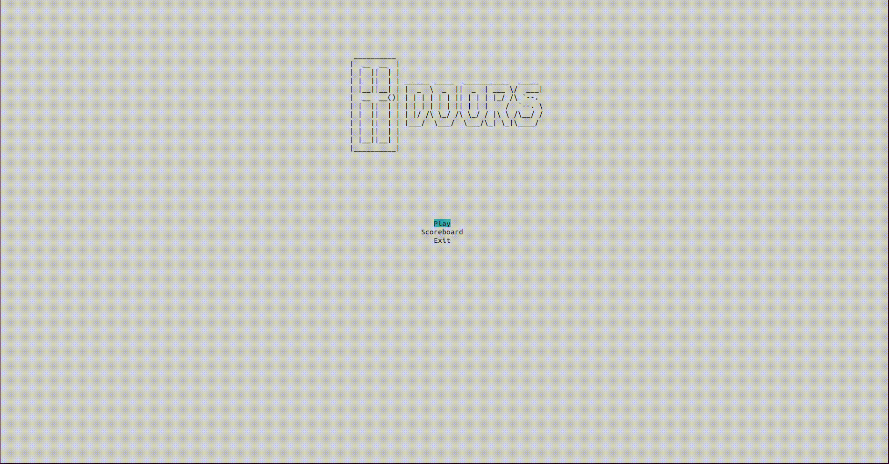

# Doors

a terminal memory game


## Installation

Requirements

```bash
  python
  curses
```
    
## How to play

```bash
python3 main.py
```

the objective is to pass as many doors as possible.

For this you must remember the number of each of the doors.

To move the cursor, use the arrows, escape to return to the menu and enter to validate


## Demo




## Features

the game is still in early development, so there will be many new features

-life system
- shop with checkpoints or life points
- money system

